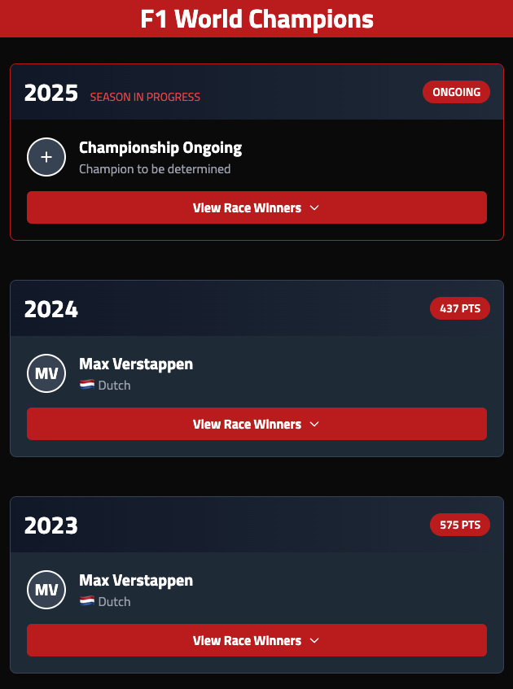
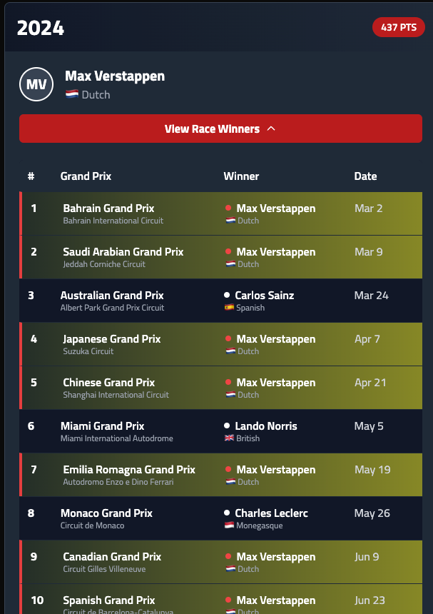
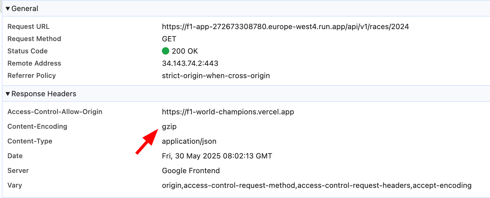
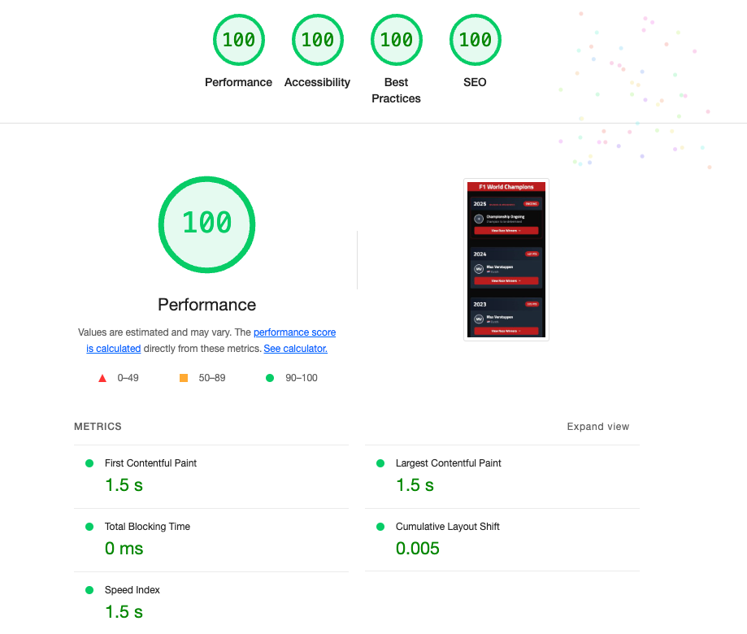
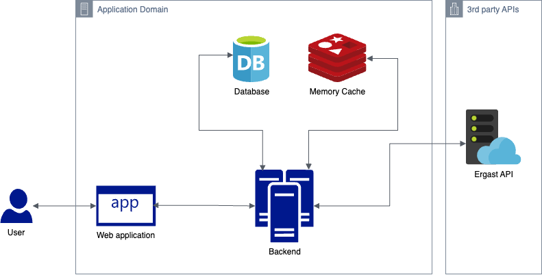
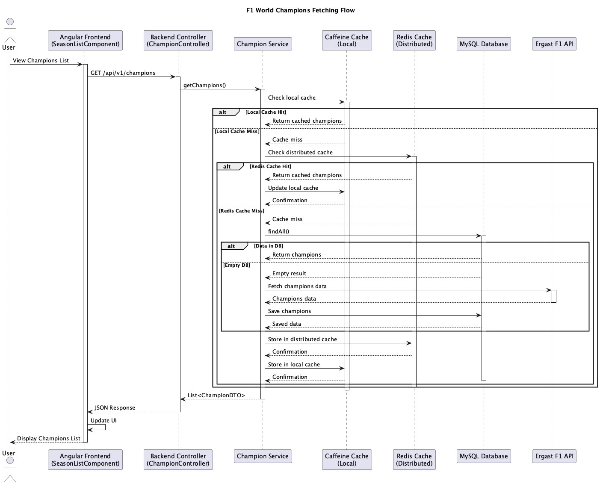
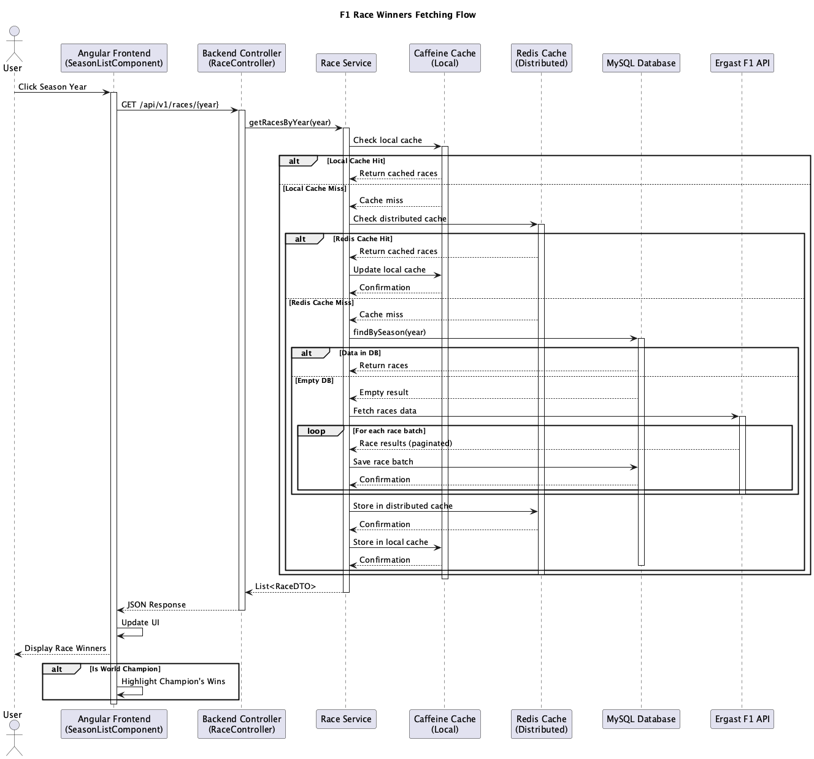
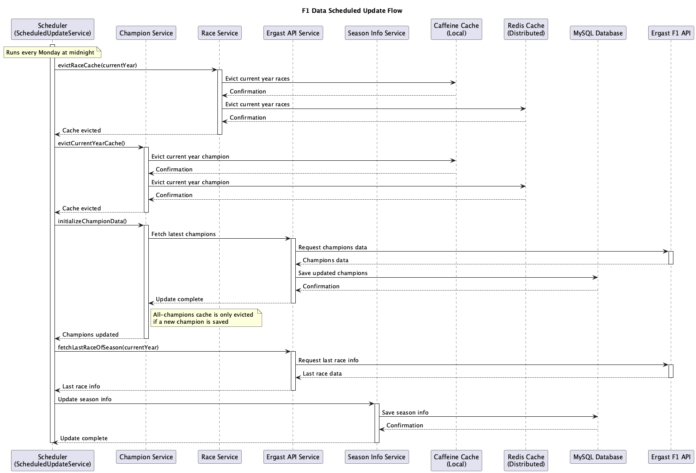

# F1 World Champions App

A modern Formula 1 statistics application that displays World Champions and race winners, built with Angular (frontend) and Spring Boot (backend).

- Frontend: https://f1-world-champions.vercel.app/
- Backend: https://f1-app-272673308780.europe-west4.run.app/api/v1 (note: swagger is available for everyone in: https://f1-app-272673308780.europe-west4.run.app/swagger-ui.html)

[How to easily run everything locally ?](#development-setup)

## Application Screenshots

### World Champions Overview


### Race Winners for 2024 Season


## Features

### Core Functionality
- View F1 World Champions by season in descending order
- Display race winners for each season with detailed information
- Highlight races won by the season's champion
- Special handling for current season with "Season in Progress" status
- Real-time updates for current season race winners

### Technical Features
- Two-layer caching strategy (Redis + Caffeine)
- Comprehensive health monitoring
- Automated data updates
- OpenAPI/Swagger documentation
- Full test coverage (unit, integration, E2E)
- Backend response compression with gzip for optimal performance
- Perfect Lighthouse performance score (100/100) for optimal user experience




## System Architecture

### Overview
The application follows a microservices architecture with the following components:



### Sequence Diagrams

The application has three main flows, documented in detail with sequence diagrams:

1. **World Champions Fetching Flow**
   
   This diagram shows how the application fetches and displays the F1 World Champions list, including caching and data persistence strategies.
   
   

2. **Race Winners Fetching Flow**
   
   This diagram illustrates the process of fetching and displaying race winners for a specific season, including pagination and champion highlighting.
   
   

3. **Scheduled Data Update Flow**
   
   This diagram shows the automated process of keeping the data up-to-date through scheduled tasks.
   
   

### Generating Architecture Diagrams

The source files for these diagrams are available in the `docs` directory:
- `docs/fetch-champions-flow.puml`
- `docs/fetch-races-flow.puml`
- `docs/scheduled-update-flow.puml`

To generate or update the diagrams:

1. Install PlantUML:
   ```bash
   # macOS
   brew install plantuml

   # Ubuntu/Debian
   sudo apt-get install plantuml

   # Windows
   choco install plantuml
   ```

2. Generate PNG files from .puml files:
   ```bash
   # Single file
   plantuml docs/fetch-champions-flow.puml

   # All files in docs directory
   plantuml docs/*.puml
   ```

3. Alternative: Use online PlantUML editor
   - Visit [PlantUML Online Editor](http://www.plantuml.com/plantuml/uml/)
   - Copy the content of your .puml file
   - Download the generated image

## Technology Stack

### Frontend
- Angular 19.2
- Standalone Components Architecture
- SCSS for styling
- Responsive design with modern UI/UX practices
- Service abstraction with interfaces
- Lazy-loaded modules
- HTTP interceptors for API communication

### Backend
- Java 17
- Spring Boot 3.5.0
- Spring Data JPA/Hibernate
- Spring Cache with Redis
- OpenAPI/Swagger documentation
- Global exception handling
- Scheduled tasks for data updates
- Health monitoring with Spring Actuator

### Data Storage
- MySQL 8.0 for persistent storage
- Redis for caching (race results and champions data)
- Two-layer caching strategy (Redis + Caffeine)

### Integration
- REST API communication between frontend and backend
- CORS configuration for security
- Ergast F1 API integration with retry mechanism
- Health checks for all services

## Prerequisites

- Java 17 or higher
- Node.js 18 or higher
- Docker and Docker Compose
- Angular CLI 19.2.12 (for local development)

## Development Setup

The easiest way to run the application in development mode is using Docker Compose:

```bash
docker compose -f docker-compose.dev.yml up --build
```

This will start:
- Backend (http://localhost:8080)
- Frontend (http://localhost:4000)
- MySQL database
- Redis cache
- Adminer (http://localhost:8081)

### Manual Development Setup

#### Backend Setup
1. Navigate to the backend directory:
   ```bash
   cd backend
   ```
2. Build the project:
   ```bash
   ./gradlew build
   ```
3. Run the application:
   ```bash
   ./gradlew bootRun
   ```

#### Frontend Setup
1. Navigate to the frontend directory:
   ```bash
   cd frontend
   ```
2. Install dependencies:
   ```bash
   npm install
   ```
3. Start the development server:
   ```bash
   npm start
   ```

## Testing

### Backend Tests
Run the backend tests with:
```bash
cd backend
./gradlew test
```

The test report will be generated at:
`backend/build/reports/jacoco/test/html/index.html`

### Frontend Tests
Run the frontend tests with:
```bash
cd frontend
npm test           # Unit tests
npm run e2e        # E2E tests in browser
npm run e2e:headless # E2E tests headless
```

## API Documentation

Once the backend is running, you can access the API documentation at:
- Swagger UI: http://localhost:8080/swagger-ui.html
- OpenAPI JSON: http://localhost:8080/v3/api-docs

### Main Endpoints

#### Champions API
```
GET /api/v1/champions
Response: List<ChampionDTO>
{
  "year": number,
  "driverId": string,
  "givenName": string,
  "familyName": string,
  "nationality": string
}
```

#### Races API
```
GET /api/v1/races/{year}
Response: List<RaceDTO>
{
  "season": number,
  "round": number,
  "raceName": string,
  "date": string,
  "circuit": {
    "circuitName": string,
    "location": {
      "country": string
    }
  },
  "results": [{
    "driver": {
      "driverId": string,
      "givenName": string,
      "familyName": string
    },
    "constructor": {
      "constructorId": string,
      "name": string
    }
  }]
}
```

## Environment Variables

### Backend
- MYSQL_HOST: MySQL server hostname
- MYSQL_PORT: MySQL server port
- MYSQL_DATABASE: Database name
- MYSQL_USER: Database username
- MYSQL_PASSWORD: Database password
- REDIS_HOST: Redis server hostname
- REDIS_PORT: Redis server port
- REDIS_PASSWORD: Redis password

## Health Monitoring

The application includes comprehensive health checks for all services:

- Backend Health: http://localhost:8080/actuator/health
- MySQL Health: Monitored via backend health checks
- Redis Health: Monitored via backend health checks
- Frontend Health: Basic HTTP check on port 4000

## Production Deployment

### Building and Publishing Docker Images

#### Example with Backend Image

```bash
# Navigate to backend directory
cd backend/

# Build the application
./gradlew build

# Build the Docker image
docker build -t f1-champions-backend:prod .

# Tag the image for Docker Hub
docker tag f1-champions-backend:prod raphaelmatori/f1-champions-backend:prod

# Push to Docker Hub
docker push raphaelmatori/f1-champions-backend:prod
```

#### Running Production Services

The production environment can be started using the production Docker Compose file:

```bash
docker compose up --build
```

For individual service deployment (you will need MySQL and REDIS up and running, either locally or remote):

```bash
# Backend
docker run -p 8080:8080 \
  -e MYSQL_PORT=<port> \
  -e MYSQL_HOST=<host> \
  -e MYSQL_USER=<user> \
  -e MYSQL_PASSWORD=<password> \
  -e MYSQL_DATABASE=<database> \
  -e REDIS_HOST=<host> \
  -e REDIS_PORT=<port> \
  -e REDIS_PASSWORD=<password> \
  raphaelmatori/f1-champions-backend:prod

# Frontend
docker run -p 4200:80 -e BACKEND_URL=<backend_url> raphaelmatori/f1-champions-frontend:prod
```

### Docker Configuration

The project includes several Docker-related files:

- `docker-compose.yml`: Production configuration
- `docker-compose.dev.yml`: Development configuration with additional services
- `backend/Dockerfile`: Multi-stage build for the backend
- `frontend/Dockerfile`: Multi-stage build for the frontend
- `frontend/Dockerfile.dev`: Development configuration for frontend

Key features of the Docker setup:
- Health checks for all services
- Volume management for data persistence
- Multi-stage builds for optimized images
- Environment-specific configurations
- Automatic service recovery
- Network isolation

## Contributing

### Development Process

1. Fork the repository
2. Create a feature branch (`git checkout -b feature/amazing-feature`)
3. Make your changes
4. Run frontend lint (if changing frontend code)
   ```bash
   # Frontend
   cd frontend && npm run lint
   ```
5. Run the unit test suite
   ```bash
   # Backend
   cd backend && ./gradlew test
   
   # Frontend
   cd frontend && npm run test:cicd
   ```
6. Run the e2e test suite
   - make sure you have the backend up and running on localhost:8080
   
   ```bash
   # Frontend
   cd frontend && npm run e2e:headless
   ```   

7. Commit your changes (`git commit -m 'Add amazing feature'`)
8. Push to the branch (`git push origin feature/amazing-feature`)
9. Open a Pull Request

### Code Style

- Backend: Follow Google Java Style Guide
- Frontend: Follow Angular Style Guide
- Use meaningful commit messages
- Keep code coverage above 70%
- Add appropriate documentation

### Branch Strategy

- `main`: Production-ready code
- `develop`: Integration branch
- `feature/*`: New features
- `bugfix/*`: Bug fixes
- `release/*`: Release preparation

## Features

- [x] Project Setup
- [x] Backend API Development (Spring Boot, REST, error handling)
- [x] Database Schema Design (JPA/Hibernate, MySQL, H2 for tests)
- [x] Redis Caching Integration
- [x] Integration with Ergast API
- [x] Unit Tests and Coverage Enforcement (≥ 70% for critical logic)
- [x] OpenAPI/Swagger Documentation
- [x] Graceful error and loading states (backend)
- [x] Race winner data persisted and served from backend after first fetch
- [x] Season list: Display each season's World Champion (2005 to present)
- [x] Race winners: Clicking a season reveals all grand‑prix winners for that year
- [x] Highlight champion in race list
- [x] Frontend Components (Angular SPA: season list, race list, highlight champion, error/loading states)
- [x] End-to-End Tests (frontend and backend integration)
- [x] CI/CD pipeline (GitHub Actions or similar: install → lint → test → build, reject on test failure)
- [x] Dockerization: Multi-stage Dockerfiles, single docker-compose.yml for backend, DB, (optionally frontend)
- [x] Healthchecks & environment variables in Docker
- [x] Documentation: High-level architecture, API contract/schema, screenshots/diagrams
- [x] Deployment Instructions (docker compose up, pipeline triggers)
- [x] Containerized admin tool (e.g., pgAdmin, optional)
- [x] Automatic deploy to free tier platform (Render, Railway, Fly.io, etc.)
- [x] Docker image pushed to public registry (optional)
- [x] Async job to refresh seasons weekly after every race (optional, nice to have)
- [x] SSR/SSG (Next.js/Nuxt) or Lighthouse score ≥ 90 (optional, nice to have)

## Known Limitations

1. Cache Management:
   - Current implementation only evicts cache for the current year
   - Could be optimized for more granular cache invalidation

2. Error Handling:
   - Basic error messages implemented
   - Could be enhanced with more detailed user feedback

3. Performance:
   - Basic caching implemented
   - Could be improved with more aggressive caching strategies

4. Custom pipelines for each branch
   - Currently, pipeline is only running for main branch

## License

This project is licensed under the MIT License - see the LICENSE.md file for details 